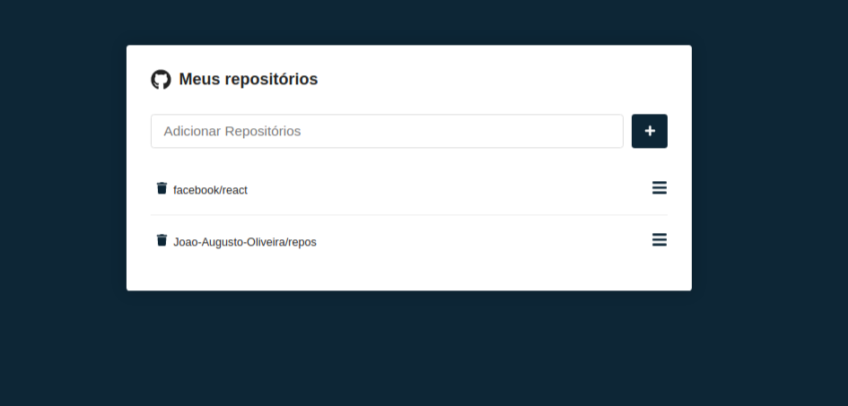
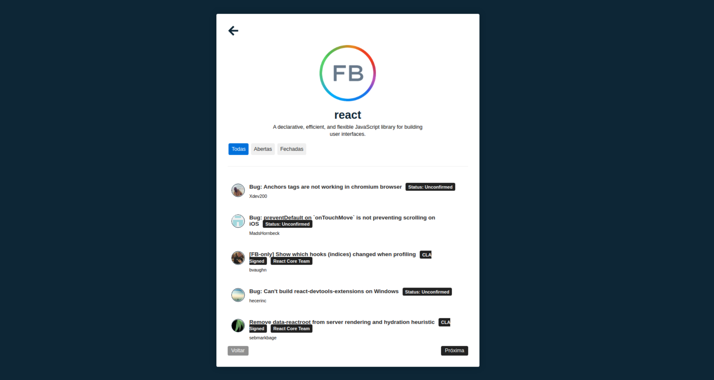

<div align=center>


<h3>

Projeto realizado no Programa React do Básico ao Avançado - do [SujeitoProgramador], utilizando **ReactJS**.

</h3>





</div>

## 📚 **Sobre**

Aplicação de listagem de repositórios e suas respectivas issues, utilizando a API do github.
<br>
<br>

Funcionalidades:
- Adicionar um respositório;
- Remover uma repositório;
- Acessar o repositório;
- Listar as issues de cada repositório;
- Filtrar as issues (todas, abertas ou fechadas);

<br>

### 📌  **Tecnologias utilizadas**
- React
- React-router-dom
- Styled-component
- React-icons
- Axios

<br>
<br>

### 🚀 **Mão na massa**

```bash
# Clone este repositório
$ git clone https://github.com/Joao-Augusto-Oliveira/repos

# Acesse a pasta do projeto no terminal/cmd
$ cd repos

# Instale as dependências
$ yarn

# Execute a aplicação em modo de desenvolvimento
$ yarn dev


```

<br>
<br>

<h3 align="center">
Feito com 💜 por <a href="https://www.linkedin.com/in/joão-augusto-oliveira-dos-santos-9b0693195">João Augusto</a>
<br><br>
 
</a>
</h3>

<!-- Links -->

[SujeitoProgramador]: https://sujeitoprogramador.com/


